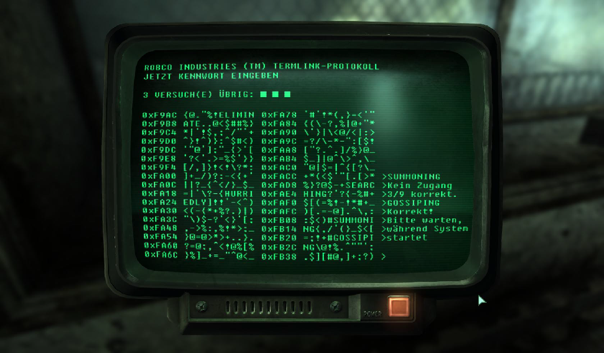
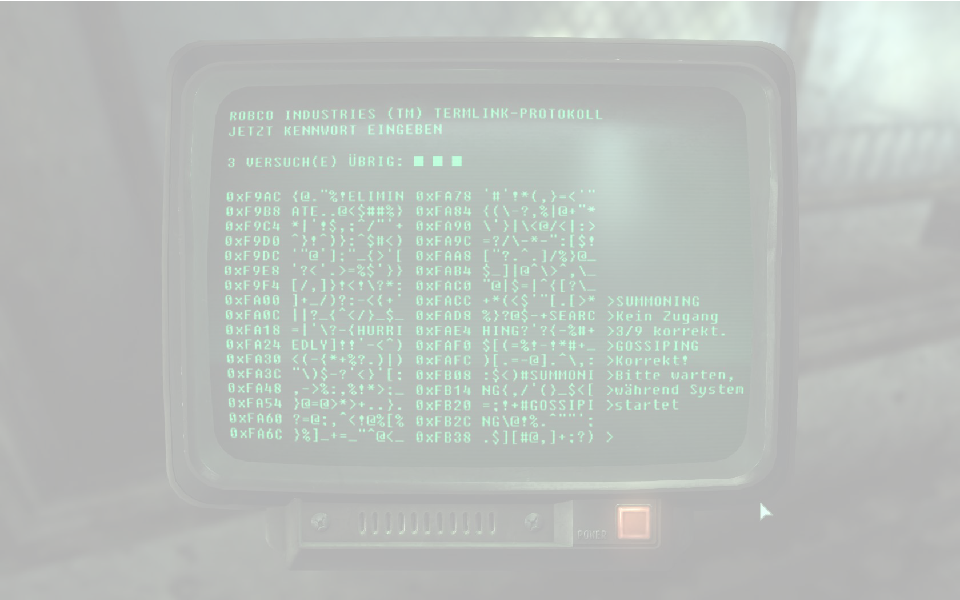

## Objective of today's talk

1. Appreciation of version revisions
2. Storage vs collaboration: Branching and Merging
3. Types of VCS: Similarities and Differences
4. Distributed eg. GIT

--- 

## VersionControl: **ADVANTAGES**

1. Work parallel
3. Update project to the latest version
2. Backtrack
4. List changes and their details
5. Version control is a safety net

--- .cover .w 
## VersionControl: **DISADVANTAGES**



--- .cover .w 



* Moderate learning curve
* Ability to work with Command Line Interfaces (CLI)

--- .cover .w

## Advantages 

* Working **concurrently**


---

## Have the Latest version

```{r eval=FALSE}
$ git pull git@github.com:arduino/Arduino.git
```


---

## Advantages Backtracking


--- .shout
## LIVE DEMO

---

## Advantages: A safety net

* Dropbox only saves up to 5 revisions from the latest version
* No save messages (end up relying on file names)
* works even if you move the file to different folder and rename the file

--- .cover

## Branching and merging


---
## Available VCSs

* SVN
* Mercurial
* GIT

---
## GIT Distributed VCSs

* Gives you the ability to work concurrently and prevents locking. 
* Each user has a full copy of the repository

---
## Git is not Github


---
## Git is not Github
* Github serves many purposes
  * central dump 
  * Wikipedia
  * Issues Submission
* Friendly for code sharing esp open source projects and collaborations (FORKING)

